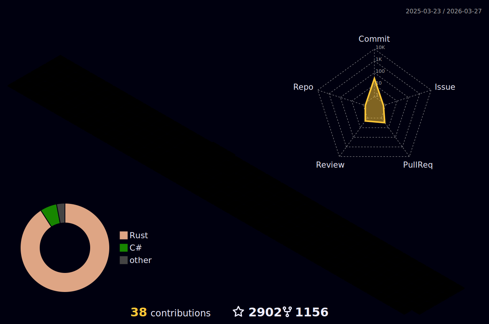

<br/>

<p align="center">
  
</p>

<br><br/> 


```typescript
const nirevil = {
    location: "Earth",
    currentFocus: "User Liberation",
    interests: ["Open Source", "Freedom to Dream"],
    build: "[/user/lib]$ make the_future"
};
```

<br><br/> 

<br/>



<br><br/> 

<!--      -->

<br/> 
  
<p align="center">
  
</p>

<hr/><br><br/>   

<br/> 

<div align="center">

[](https://github.com/NiREvil)
[](mailto:nirevil@proton.me)
[](https://instagram.com/nima_raadical)
[](https://t.me/F_NiREvil)
[](https://twitter.com/NiREvil_)

</div>
